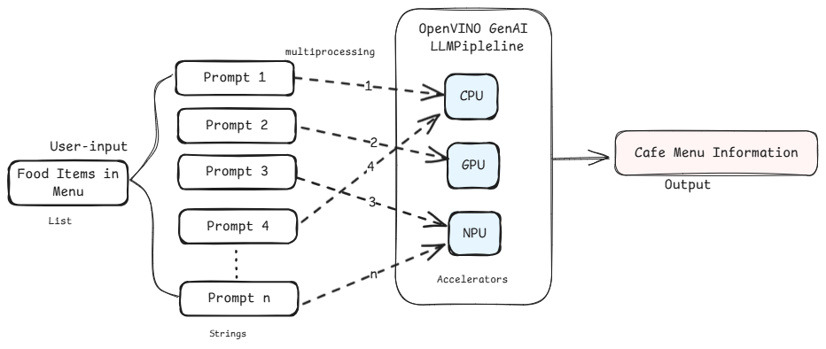
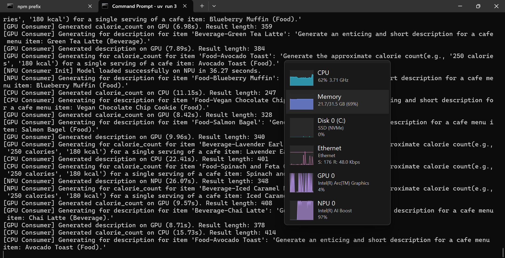

# Distributed Inference on AI PC Accelerators using OpneVINO Backend

## Overview


## Contents
- [Sample Workflow](./README.md#sample-workflow)
- [Setup Environment using `uv`](./README.md#setup-environment-using-uv)
  - [For Windows](./README.md#for-windows)
  - [For Linux](./README.md#for-linux)
- [Manual Download of Huggingface Models](./README.md#manual-download-of-huggingface-models)
- 
- [XPU Usage](./README.md#xpu-usage)
- [Troubleshooting](./README.md#troubleshooting)
- [License](./README.md#license)


## Sample Workflow



## Setup Environment using `uv`
### For Windows:
To install any software using commands, Open the Command Prompt as an administrator by right-clicking the terminal icon and selecting `Run as administrator`.
1. **GPU Drivers installation**\
   Download and install the Intel® Graphics Driver for Intel® Arc™ B-Series, A-Series, Intel® Iris® Xe Graphics, and Intel® Core™ Ultra Processors with Intel® Arc™ Graphics from [here](https://www.intel.com/content/www/us/en/download/785597/intel-arc-iris-xe-graphics-windows.html)\
   >**NOTE:** Reboot the system after the installation.

2. **Git for Windows**\
   Download and install Git from [here](https://git-scm.com/downloads/win)

3. **uv for Windows**\
   Steps to install `uv` in the Command Prompt are as follows. Please refer to the [documentation](https://docs.astral.sh/uv/getting-started/installation/) for more information.
   ```
   powershell -ExecutionPolicy ByPass -c "irm https://astral.sh/uv/install.ps1 | iex"
   ```
   >**NOTE:** Close and reopen the Command Prompt to recognize uv.
   
### For Linux:
To install any software using commands, Open a new terminal window by right-clicking the terminal and selecting `New Window`.
1. **GPU Drivers installation**\
   Download and install the GPU drivers from [here](https://dgpu-docs.intel.com/driver/client/overview.html)

2. **Dependencies on Linux**\
   Install Curl, Wget, Git using the following commands:
   - For Debian/Ubuntu-based systems:
   ```
   sudo apt update && sudo apt -y install curl wget git
   ```
   - For RHEL/CentOS-based systems:
   ```
   sudo dnf update && sudo dnf -y install curl wget git
   ```

3. **uv for Linux**\
   Steps to install uv are as follows. Please refer to the [documentation](https://docs.astral.sh/uv/getting-started/installation/) for more information.
   - If you want to use curl to download the script and execute it with sh:
   ```
   curl -LsSf https://astral.sh/uv/install.sh | sh
   ```
   - If you want to use wget to download the script and execute it with sh:
   ```
   wget -qO- https://astral.sh/uv/install.sh | sh
   ```
   >**NOTE:** Close and reopen the Terminal to recognize uv.

---

## Manual Download of Huggingface Models
1. Navigate to the sample directory:
   ```bash
   cd <path/to/Distributed-Inference-on AI PC/folder>
   ```
   
2. Log in to Hugging Face, generate a token, and download the required model:\
   `huggingface-cli` lets you interact directly with the Hugging Face Hub from a terminal. Log in to [Huggingface](https://huggingface.co/) with your credentials. You need a [User Access Token](https://huggingface.co/docs/hub/security-tokens) from your [Settings page](https://huggingface.co/settings/tokens). The User Access Token is used to authenticate your identity to the Hub.\
   Once you have your token, run the following command in your terminal.
   ```
   uv run huggingface-cli login
   ```
   This command will prompt you for a token. Copy-paste yours and press Enter.
   ```
   uv run huggingface-cli download OpenVINO/Mistral-7B-Instruct-v0.2-int4-cw-ov
   ```
   


## Intel Accelerators Usage
Text Generation tasks are distributed accross the available Intel hardware  
  

  

## Troubleshooting
> If you face any dependencies issues, please clean your uv environment and try again
>  ```bash
> uv clean
> ```

## License
Code samples are licensed under the MIT license. See [License.txt](https://github.com/oneapi-src/oneAPI-samples/blob/master/License.txt) for details.
Third party program Licenses can be found here: [third-party-programs.txt.](https://github.com/oneapi-src/oneAPI-samples/blob/master/third-party-programs.txt)

