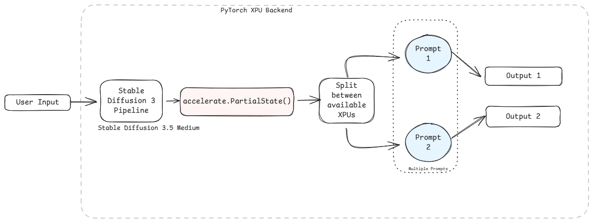
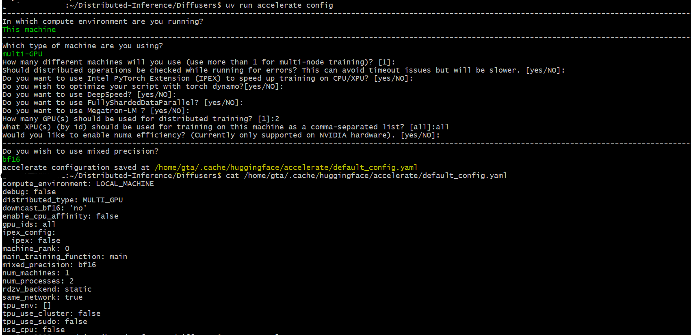
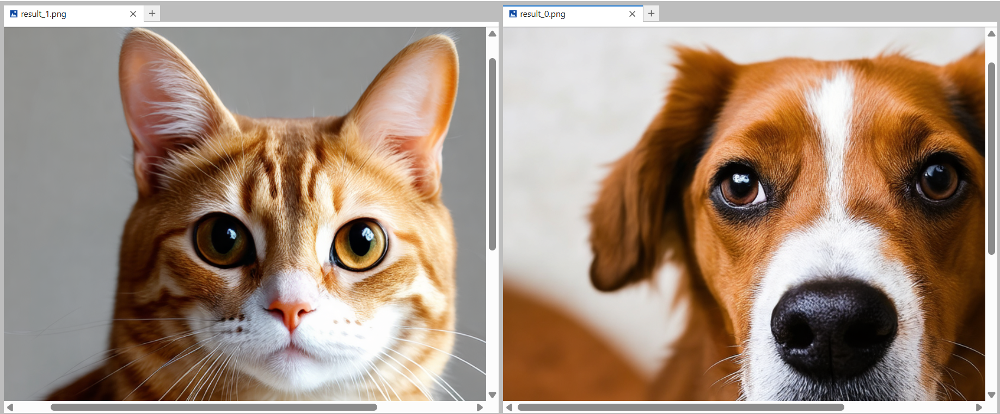
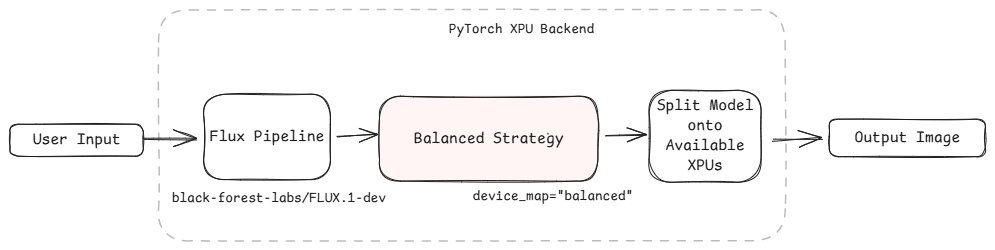
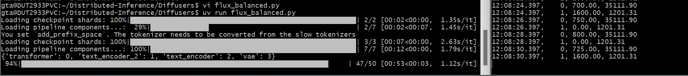
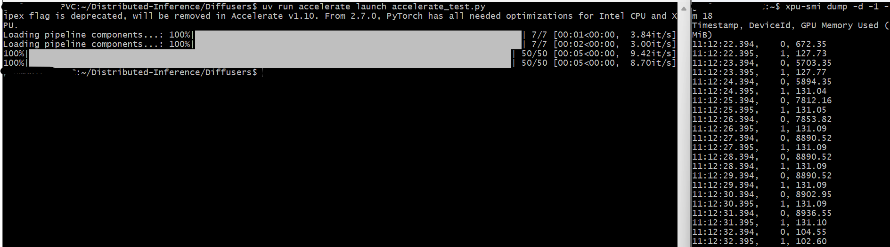
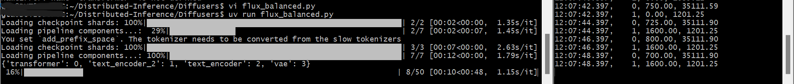

# Distributed Inference on Multi-GPUs using PyTorch XPU Backend

## Introduction
As deep learning models grow in complexity and demand, distributed inference offers a powerful solution to optimize performance, scale inference capabilities, and handle high-throughput workloads. 
By distributing the model and/or the inference workload across multiple GPUs, either on a single machine or across a cluster of machines, this approach enables faster predictions and the ability to serve larger models that might otherwise exceed the memory capacity of a single XPU.

This sample focuses on common approaches and tools used for multi-GPU distributed inference, specifically leveraging PyTorch's XPU backend.

## Contents
- [Setup Environment using `uv`](./README.md#setup-environment-using-uv)
  - [For Windows](./README.md#for-windows)
  - [For Linux](./README.md#for-linux)
- [Manual Download of Huggingface Models](./README.md#manual-download-of-huggingface-models)
- [Key Approaches](./README.md#key-approaches)
- [Data Parallelism](./README.md#data-parallelism)
  - [Huggingface Accelerate](./README.md#hugging-face-accelerate)
    - [Run the `Data Parallelism` Sample](./README.md#run-the-data-parallelism-sample)
- [Model Parallelism or Model Sharding](./README.md#model-paralelllism-or-model-sharding)
  - [Run the `Model Parallelism` Sample](./README.md#run-the-model-parallelism-sample)
- [XPU Usage](./README.md#xpu-usage)
- [Troubleshooting](./README.md#troubleshooting)
- [License](./README.md#license)

## Setup Environment using `uv`
### For Windows:
To install any software using commands, Open the Command Prompt as an administrator by right-clicking the terminal icon and selecting `Run as administrator`.
1. **GPU Drivers installation**\
   Download and install the Intel® Graphics Driver for Intel® Arc™ B-Series, A-Series, Intel® Iris® Xe Graphics, and Intel® Core™ Ultra Processors with Intel® Arc™ Graphics from [here](https://www.intel.com/content/www/us/en/download/785597/intel-arc-iris-xe-graphics-windows.html)\
   >**NOTE:** Reboot the system after the installation.

2. **Git for Windows**\
   Download and install Git from [here](https://git-scm.com/downloads/win)

3. **uv for Windows**\
   Steps to install `uv` in the Command Prompt are as follows. Please refer to the [documentation](https://docs.astral.sh/uv/getting-started/installation/) for more information.
   ```
   powershell -ExecutionPolicy ByPass -c "irm https://astral.sh/uv/install.ps1 | iex"
   ```
   >**NOTE:** Close and reopen the Command Prompt to recognize uv.
   
### For Linux:
To install any software using commands, Open a new terminal window by right-clicking the terminal and selecting `New Window`.
1. **GPU Drivers installation**\
   Download and install the GPU drivers from [here](https://dgpu-docs.intel.com/driver/client/overview.html)

2. **Dependencies on Linux**\
   Install Curl, Wget, Git using the following commands:
   - For Debian/Ubuntu-based systems:
   ```
   sudo apt update && sudo apt -y install curl wget git
   ```
   - For RHEL/CentOS-based systems:
   ```
   sudo dnf update && sudo dnf -y install curl wget git
   ```

3. **uv for Linux**\
   Steps to install uv are as follows. Please refer to the [documentation](https://docs.astral.sh/uv/getting-started/installation/) for more information.
   - If you want to use curl to download the script and execute it with sh:
   ```
   curl -LsSf https://astral.sh/uv/install.sh | sh
   ```
   - If you want to use wget to download the script and execute it with sh:
   ```
   wget -qO- https://astral.sh/uv/install.sh | sh
   ```
   >**NOTE:** Close and reopen the Terminal to recognize uv.

---

## Manual Download of Huggingface Models
1. Navigate to the sample directory:
   ```bash
   cd <path/to/Distributed-Inference-using-Multi-GPUs/folder>
   ```
   
2. Log in to Hugging Face, generate a token, and download the required model:\
   `huggingface-cli` lets you interact directly with the Hugging Face Hub from a terminal. Log in to [Huggingface](https://huggingface.co/) with your credentials. You need a [User Access Token](https://huggingface.co/docs/hub/security-tokens) from your [Settings page](https://huggingface.co/settings/tokens). The User Access Token is used to authenticate your identity to the Hub.\
   Once you have your token, run the following command in your terminal.
   ```
   uv run huggingface-cli login
   ```
   This command will prompt you for a token. Copy-paste yours and press Enter.
   ```
   uv run huggingface-cli download black-forest-labs/FLUX.1-dev
   uv run huggingface-cli download stabilityai/stable-diffusion-3.5-medium
   ```
   

## Key Approaches
- Data Parallelism
- Model Parallelism

## Data Parallelism
In distributed setups, you can perform inference across multiple GPUs using either [Hugging Face Accelerate](https://huggingface.co/docs/accelerate/index). Data parallelism is particularly useful for **generating outputs with multiple prompts in parallel**.



### Hugging Face Accelerate
- Simplifies the process of setting up and managing the distributed environment.
- To begin, create a Python script and initialize an `accelerate.PartialState` object to define your distributed environment.
- Your hardware setup is automatically detected, eliminating the need to explicitly define `rank` or `world_size` parameters.
- Move your `DiffusionPipeline` or model to `distributed_state.device` to ensure it's assigned to the correct XPU for each process.
- Utilize the `split_between_processes` utility as a context manager. This automatically distributes a given list of prompts among the available processes.

#### **Run the `Data Parallelism` Sample:**
1. Configure accelerate with the following command:
   ```bash
    uv run accelerate config
   ```
   1. Choose Multi-GPU and appropriate options for correct configuration as shown below:
      
    
    
2. Run the sample:
    ```bash
    uv run accelerate launch data-parallelism-accelerate.py --num-processes=2
    ```
    OR (if `accelerate` is configured to use all available GPUs by default)
    ```bash
    uv run accelerate launch data-parallelism-accelerate.py
    ```
    > **Note:** The `--num-processes` parameter can often be omitted if `accelerate` is pre-configured to utilize all available GPUs. 
3. Output are generated in parallel as multiple prompts are passed.

    
   

## Model Parallelism or Model Sharding
Model sharding is a crucial technique for distributing large models across multiple XPUs when their entire footprint does not fit on a single XPU's memory.



- For Hugging Face models, a common strategy for model sharding is to use `device_map="balanced"`.
- This configuration intelligently distributes the model's layers across all available XPUs to ensure an even load and optimize memory usage.
  
!

### Run the `Model Parallelism` Sample
Commands to run:
```bash
uv run model-parallelism-flux.py
```

## XPU Usage
- XPU Usage for Data Parallelism using Accelerate
  
  
  
- Model Sharding
  
  

## Troubleshooting
> If you face any dependencies issues, please clean your uv environment and try again
>  ```bash
> uv clean
> ```

## License
Code samples are licensed under the MIT license. See [License.txt](https://github.com/oneapi-src/oneAPI-samples/blob/master/License.txt) for details.
Third party program Licenses can be found here: [third-party-programs.txt.](https://github.com/oneapi-src/oneAPI-samples/blob/master/third-party-programs.txt)

